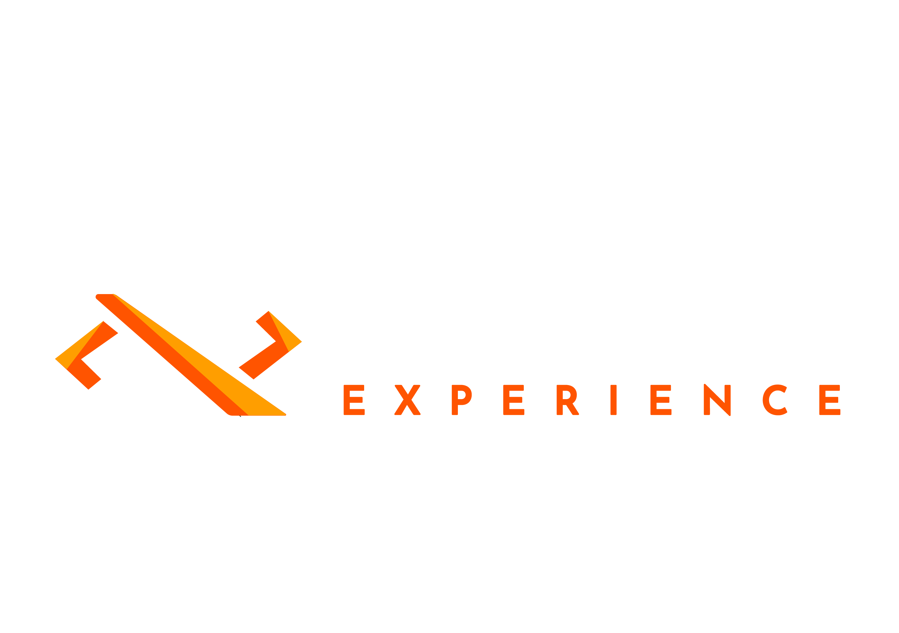

<!-- ========================= -->
<!-- Banner -->
<!-- ========================= -->

  

<!-- ========================= -->
<!-- Metrics -->
<!-- ========================= -->

  
  

  
    Last credit top-up: <strong>USD $100</strong> · <strong>Dec 31, 2025</strong>
  

## 📈 Platform Growth Metrics (Last 3 Months)

> Growth indicators based on **manual tracking and internal positioning data**,  
> reflecting visibility and reach progression over the last 90 days.

---

### 🔵 Facebook

  
  

- Increased organic reach and engagement  
- Improved campaign positioning and content indexing  

---

### 🟣 Instagram

  
  

- Higher profile discovery rate  
- Growth driven by optimized content structure and hashtags  

---

### 🟢 WhatsApp Business

  
  

- Increased inbound conversations  
- Improved funnel integration with landing pages and ads  

---

### 🔷 LinkedIn

  
  

- Strong improvement in professional visibility  
- Increased impressions on technical and founder-oriented content  

---

### 🔴 Pinterest

  
  

- Gradual indexing improvement  
- Long-term traffic positioning growth  

---

### 📌 Interpretation

> These metrics indicate **consistent upward positioning trends**,  
> supporting readiness for **production launch and scaling efforts**.

---

# 👋 Adixon Camacho

### Founder · Full Stack Engineer · SaaS Architect  
**ADX Store Inc. / ADX Platform**

---

## 🚀 About Me

I am a **Full Stack Engineer and Founder** focused on building **scalable SaaS platforms**, microservice architectures, and digital solutions designed for growth, automation, and long-term positioning.

My work connects **technology, business strategy, and digital execution**, taking real-world products from concept to production.

---

## 🏢 Company

**ADX Store Inc.**  
Technology platform focused on:
- Multi-tenant SaaS solutions
- Enterprise BackOffice systems
- Digital positioning and automation
- Social platform and marketplace integrations

---

## 📊 Strategic Status

> The following indicators represent the **current maturity and readiness level** of active initiatives.

### 💰 Positioning Credits
**USD $6,400** available in digital positioning credits  
(traffic acquisition, visibility, advertising, and product launches)

### 🚧 Projects in Preparation
Currently ranked **#21** among new projects  
**approaching production release** within digital positioning and deployment ecosystems.

---

## 🧠 Core Expertise

- SaaS architecture and microservices
- Backend development with **TypeScript (NestJS)** and **Rust**
- Security, authentication, and performance optimization
- Web and mobile development (**Flutter**)
- Automation pipelines and deployment workflows
- Third-party platform and service integrations

---

## 🧰 Tech Stack

---

## 🌐 Digital Presence

> Displayed as **manual references** to represent platform presence and positioning reach.

  
  
  
  
  

---

## 📌 Highlighted Projects

- **ADX BackOffice** – Enterprise SaaS administrative platform
- **ADX Platform** – Modular, multi-service SaaS ecosystem
- **Pixahi** – Digital automation and positioning solution
- Backend and mobile integrations under active development

*(Key repositories are pinned on the profile)*

---

## 🌍 Web Portfolio

👉 **https://adixonjcdev.github.io**

---

## 📫 Contact

- GitHub: https://github.com/adixonjcdev  
- LinkedIn: *(add when ready)*  
- Email: *(optional)*

---

> _Building real products with technical depth, business vision, and disciplined execution._
